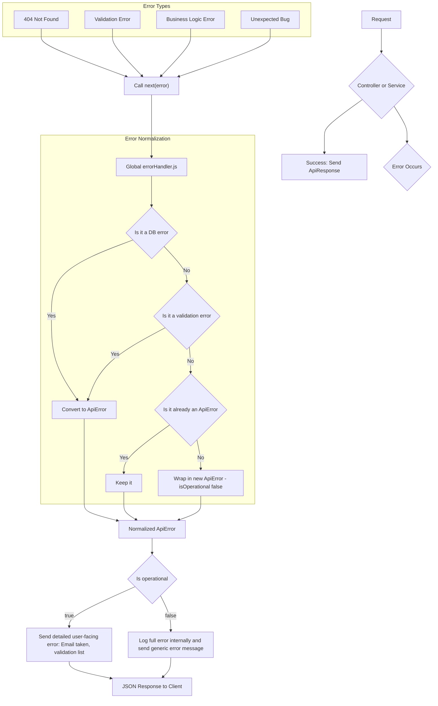

# API Error Handling Flow

This document outlines the complete error handling and response flow for the API.

```mermaid
graph TD
    A[Request] --> B{Controller or Service}
    B --> C[Success: Send ApiResponse]
    B --> D{Error Occurs}

    subgraph Error Types
        direction LR
        D1[404 Not Found]
        D2[Validation Error]
        D3[Business Logic Error]
        D4[Unexpected Bug]
    end

    D1 & D2 & D3 & D4 --> E["Call next(error)"]
    E --> F["Global errorHandler.js"]

    subgraph Error Normalization
        F --> G{Is it a DB error}
        G -->|Yes| H[Convert to ApiError]
        G -->|No| I{Is it a validation error}
        I -->|Yes| H
        I -->|No| J{Is it already an ApiError}
        J -->|Yes| K[Keep it]
        J -->|No| L[Wrap in new ApiError - isOperational false]
    end

    H & K & L --> M[Normalized ApiError]

    M --> N{Is operational}
    N -->|true| O[Send detailed user-facing error: Email taken, validation list]
    N -->|false| P[Log full error internally and send generic error message]

    O & P --> Q[JSON Response to Client]
```
