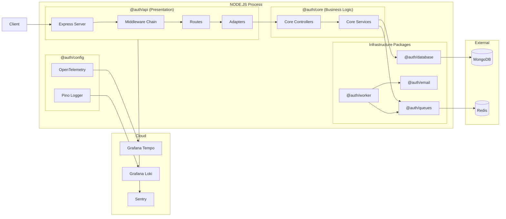
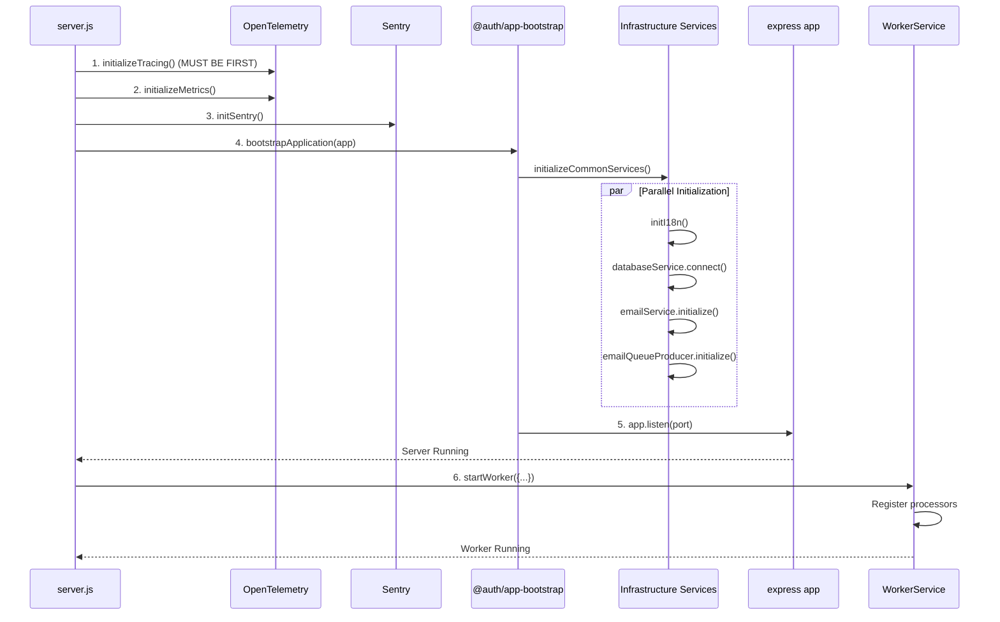
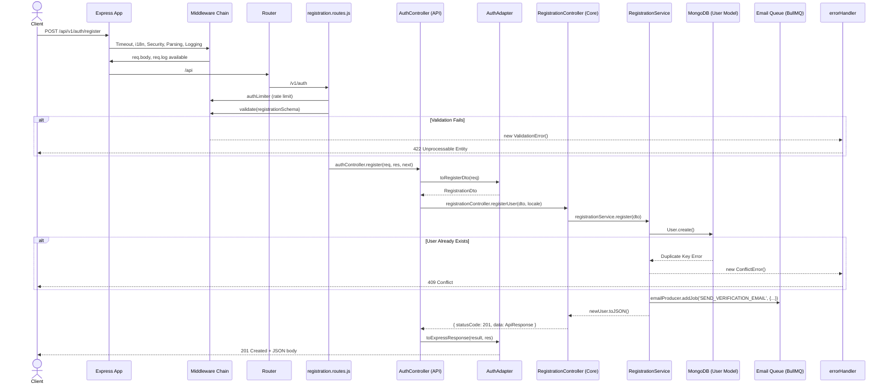
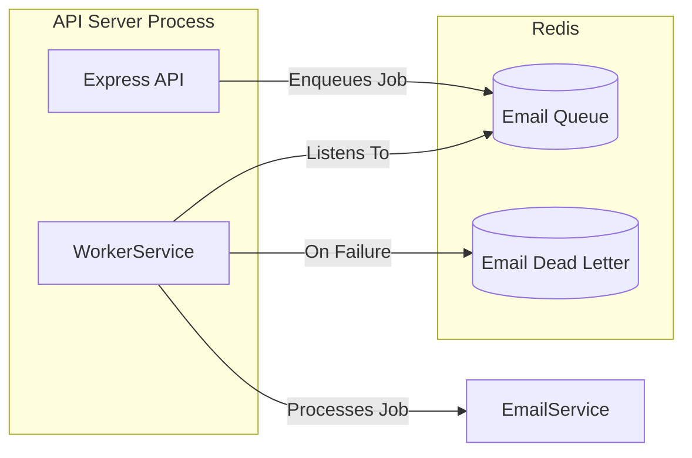
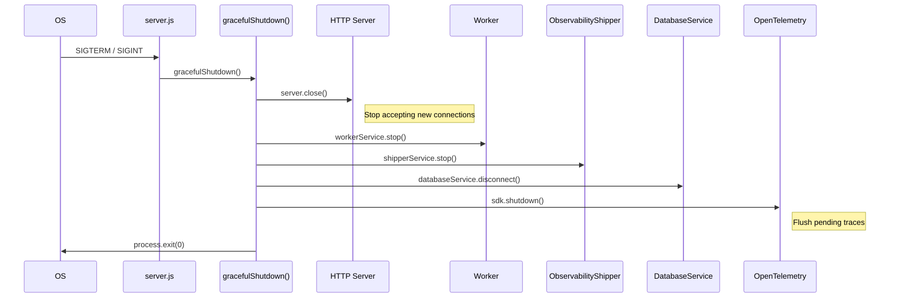

# Auth Monorepo: Architecture & HTTP Request Lifecycle

This document provides a comprehensive overview of the `auth` monorepo, from startup to shutdown, and traces the complete lifecycle of an HTTP request.

---

## Table of Contents

1.  [High-Level Architecture](#high-level-architecture)
2.  [Monorepo Structure](#monorepo-structure)
3.  [Application Startup Sequence](#application-startup-sequence)
4.  [Middleware Pipeline](#middleware-pipeline)
5.  [HTTP Request Lifecycle (End-to-End)](#http-request-lifecycle-end-to-end)
6.  [Background Worker Architecture](#background-worker-architecture)
7.  [Observability Stack](#observability-stack)
8.  [Graceful Shutdown](#graceful-shutdown)

---

## 1. High-Level Architecture

The application follows a **Clean Architecture / Hexagonal Architecture** pattern, separating concerns into distinct layers.



---

## 2. Monorepo Structure

The project is a **pnpm monorepo** using **Turborepo** for build orchestration.

| Package           | Path                  | Responsibility                                                              |
| :---------------- | :-------------------- | :-------------------------------------------------------------------------- |
| `@auth/api`       | `packages/api`        | Express HTTP server, routes, middleware, and request adapters.             |
| `@auth/core`      | `packages/core`       | Framework-agnostic business logic: services, controllers, DTOs, validators. |
| `@auth/config`    | `packages/config`     | Centralized configuration, logging (Pino), i18n, Redis connection, and observability (tracing, metrics). |
| `@auth/database`  | `packages/database`   | Mongoose models, schemas, and the `DatabaseService` class.                  |
| `@auth/email`     | `packages/email`      | Email sending logic, provider abstraction (Resend, SendGrid, etc.).         |
| `@auth/queues`    | `packages/queues`     | BullMQ queue producers and consumers for background jobs.                   |
| `@auth/worker`    | `packages/worker`     | `WorkerService` to run BullMQ workers for processing jobs.                  |
| `@auth/utils`     | `packages/utils`      | Shared utilities, custom error classes, HTTP status codes.                  |
| `@auth/app-bootstrap` | `packages/app-bootstrap` | Application startup logic, service factories, and graceful shutdown.      |

---

## 3. Application Startup Sequence

The application starts from [packages/api/src/server.js](file:///home/home/codes/web/udemy/fullstack-prac/auth/packages/api/src/server.js).



### Key Files Involved

1.  **[server.js](file:///home/home/codes/web/udemy/fullstack-prac/auth/packages/api/src/server.js)**: The main entry point. Orchestrates initialization order.
2.  **[tracing.js](file:///home/home/codes/web/udemy/fullstack-prac/auth/packages/config/src/observability/tracing.js)**: Initializes OpenTelemetry SDK. **Must be imported first** to auto-instrument subsequent modules (Express, MongoDB, Redis).
3.  **[bootstrap.js](file:///home/home/codes/web/udemy/fullstack-prac/auth/packages/app-bootstrap/src/bootstrap.js)**: Contains `bootstrapApplication()` and `initializeCommonServices()`. This is the **Composition Root** where infrastructure services are wired together via factory functions.

---

## 4. Middleware Pipeline

Middleware is defined in [packages/api/src/app.js](file:///home/home/codes/web/udemy/fullstack-prac/auth/packages/api/src/app.js) and applied in a specific order.

```
Request →
  │
  ├── 1. createTimeoutMiddleware(30000)     // Request timeout guard
  │
  ├── 2. i18nMiddleware                     // Internationalization
  │
  ├── 3. configureMiddleware(app)           // (from setup.js)
  │       ├── cors()                        // Cross-Origin Resource Sharing
  │       ├── helmet()                      // Security headers (CSP, HSTS, etc.)
  │       ├── hpp()                         // HTTP Parameter Pollution protection
  │       ├── expressMongoSanitize()        // NoSQL injection protection
  │       ├── compression()                 // Gzip compression
  │       ├── express.json()                // Body parsing
  │       ├── express.urlencoded()          // URL-encoded body parsing
  │       └── httpLogger (pino-http)        // Request logging with trace IDs
  │
  ├── 4. sentryUserMiddleware               // Sentry user context
  │
  ├── 5. metricsMiddleware                  // Prometheus HTTP metrics (OTLP push)
  │
  ├── 6. /healthz (Liveness)
  │
  ├── 8. apiVersionMiddleware               // API versioning headers
  │
  ├── 9. apiLimiter (rate limiting)         // Global rate limit for /api
  │
  ├── 10. router (/api)                     // Main API routes
  │
  ├── 11. 404 Handler (NotFoundError)
  │
  ├── 12. timeoutErrorHandler
  │   
  ├── 13. Sentry.setupExpressErrorHandler() // Sentry error capture
  │
  └── 14. errorHandler                      // Global error formatter
                                            → Response
```

---

## 5. HTTP Request Lifecycle (End-to-End)

Let's trace a `POST /api/v1/auth/register` request from start to finish.



### Code Path Summary

| Step | File                                                                 | Function / Class                      |
| :--- | :------------------------------------------------------------------- | :------------------------------------ |
| 1    | [app.js](file:///home/home/codes/web/udemy/fullstack-prac/auth/packages/api/src/app.js)                 | Middleware chain, `router`              |
| 2    | [router.js](file:///home/home/codes/web/udemy/fullstack-prac/auth/packages/api/src/router.js)           | Mounts `/v1/auth` to `authRoutes`       |
| 3    | [registration.routes.js](file:///home/home/codes/web/udemy/fullstack-prac/auth/packages/api/src/features/auth/registration.routes.js) | `authLimiter`, `validate()`, `authController.register` |
| 4    | [auth.adapter.instance.js](file:///home/home/codes/web/udemy/fullstack-prac/auth/packages/api/src/features/auth/auth.adapter.instance.js) | Wires `AuthController` with dependencies |
| 5    | [auth.controller.js](file:///home/home/codes/web/udemy/fullstack-prac/auth/packages/api/src/features/auth/auth.controller.js) | `AuthController.register()` - Express-specific controller |
| 6    | [auth.adapter.js](file:///home/home/codes/web/udemy/fullstack-prac/auth/packages/api/src/features/auth/auth.adapter.js) | `toRegisterDto()`, `toExpressResponse()` |
| 7    | [registration.controller.js](file:///home/home/codes/web/udemy/fullstack-prac/auth/packages/core/src/features/auth/registration/registration.controller.js) | `RegistrationController.registerUser()` - Core controller |
| 8    | [registration.service.js](file:///home/home/codes/web/udemy/fullstack-prac/auth/packages/core/src/features/auth/registration/registration.service.js) | `RegistrationService.register()` - Business logic |
| 9    | [@auth/database](file:///home/home/codes/web/udemy/fullstack-prac/auth/packages/database) | `User` Mongoose model                   |
| 10   | [@auth/queues](file:///home/home/codes/web/udemy/fullstack-prac/auth/packages/queues)   | `emailProducer.addJob()`                |
| 11   | [errorHandler.js](file:///home/home/codes/web/udemy/fullstack-prac/auth/packages/api/src/middleware/core/errorHandler.js) | Catches errors, formats response        |

---

## 6. Background Worker Architecture

The worker runs **in the same Node.js process** as the API server.



### Key Files

-   [worker.setup.js](file:///home/home/codes/web/udemy/fullstack-prac/auth/packages/api/src/worker.setup.js): Factory for `WorkerService`, registers processors.
-   [@auth/worker](file:///home/home/codes/web/udemy/fullstack-prac/auth/packages/worker): The `WorkerService` class.
-   [@auth/worker/consumers/email](file:///home/home/codes/web/udemy/fullstack-prac/auth/packages/worker/src/consumers/email.js): The `createEmailJobConsumer` factory.

---

## 7. Observability Stack

| Signal  | Library          | Destination         | Key File                                                                 |
| :------ | :--------------- | :------------------ | :----------------------------------------------------------------------- |
| **Logs**   | Pino, pino-http  | Grafana Cloud Loki  | `@auth/config/src/logging/`                                            |
| **Traces** | OpenTelemetry    | Grafana Cloud Tempo | [tracing.js](file:///home/home/codes/web/udemy/fullstack-prac/auth/packages/config/src/observability/tracing.js) |
| **Metrics**| Prometheus Client / OTLP | Grafana Cloud | [metrics.js](file:///home/home/codes/web/udemy/fullstack-prac/auth/packages/config/src/observability/metrics.js) |
| **Errors** | Sentry           | Sentry Cloud        | [sentry.js](file:///home/home/codes/web/udemy/fullstack-prac/auth/packages/api/src/config/sentry.js) |

**Correlation**: Pino logs include `traceId` and `spanId` from OpenTelemetry, enabling seamless navigation from logs to traces in Grafana.

---

## 8. Graceful Shutdown

Handled in [bootstrap.js](file:///home/home/codes/web/udemy/fullstack-prac/auth/packages/app-bootstrap/src/bootstrap.js).



---

## Summary

This architecture provides:

1.  **Separation of Concerns**: HTTP handling is isolated from business logic.
2.  **Testability**: Dependencies are injected, making unit testing straightforward.
3.  **Observability**: Full trace-log-metric correlation out of the box.
4.  **Resilience**: Graceful shutdown, timeouts, and rate limiting are built-in.
