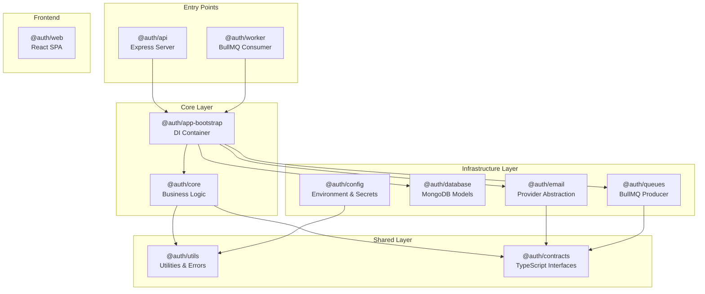

# Auth Monorepo - TypeScript Codebase Explanation

> **Production-Grade Authentication System**  
> A scalable, enterprise-ready authentication monorepo built with TypeScript, Node.js, and modern best practices.

---

## Table of Contents

1. [Architecture Overview](#architecture-overview)
2. [Package Structure](#package-structure)
3. [Technology Stack](#technology-stack)
4. [Key Design Patterns](#key-design-patterns)
5. [TypeScript Configuration](#typescript-configuration)
6. [Package Details](#package-details)
7. [Observability](#observability)
8. [Email System](#email-system)
9. [Queue System](#queue-system)
10. [Testing Strategy](#testing-strategy)
11. [Development Workflow](#development-workflow)
12. [Migration Strategy](#migration-strategy)
13. [Best Practices](#best-practices)

---

## Architecture Overview



---

## Package Structure

```
auth/
├── packages/
│   ├── api/              # Express API server (entry point)
│   ├── app-bootstrap/    # Dependency injection container
│   ├── config/           # Environment configuration
│   ├── contracts/        # TypeScript interfaces (DI contracts)
│   ├── core/             # Business logic services
│   ├── database/         # MongoDB models & repositories
│   ├── email/            # Email provider abstraction
│   ├── queues/           # BullMQ producer & job definitions
│   ├── utils/            # Shared utilities & error classes
│   ├── web/              # React frontend (Vite)
│   └── worker/           # BullMQ worker (background jobs)
├── tsconfig.json         # Root TypeScript config
├── tsconfig.base.json    # Base config for packages
├── turbo.json            # Turborepo configuration
└── package.json          # Monorepo root
```

---

## Technology Stack

| Category | Technology | Purpose |
|----------|------------|---------|
| **Language** | TypeScript 5.x | Type safety, developer experience |
| **Runtime** | Node.js 22 | JavaScript runtime |
| **Framework** | Express.js | HTTP server |
| **Database** | MongoDB | Document database |
| **Cache/Queue** | Redis + BullMQ | Caching & job queues |
| **Email** | Resend + MailerSend | Dual-provider email with failover |
| **Observability** | OpenTelemetry | Traces, metrics, logs |
| **Monitoring** | Grafana Cloud | Loki (logs), Tempo (traces), Prometheus (metrics) |
| **Build** | Turborepo | Monorepo build orchestration |
| **Package Manager** | pnpm | Fast, efficient package management |
| **Testing** | Vitest | Modern test runner |
| **Linting** | ESLint 9 | Code quality |

---

## Key Design Patterns

### 1. Dependency Injection (DI)

The codebase uses a manual DI pattern via `@auth/app-bootstrap`:

```javascript
// app-bootstrap/src/bootstrap.js
export async function bootstrapServices() {
  const logger = createLogger();
  const redis = await connectRedis();
  const database = await connectDatabase();
  
  // Inject dependencies into services
  const tokenService = new TokenService({ redis, config, logger });
  const emailService = new EmailService({ providerService, config, logger });
  
  return { tokenService, emailService, ... };
}
```

### 2. Interface Segregation (Contracts)

All services implement interfaces defined in `@auth/contracts`:

```typescript
// contracts/src/IEmailProvider.ts
export interface IEmailProvider {
  readonly name: string;
  send(mailOptions: MailOptions): Promise<EmailSendResult>;
  verifyWebhookSignature(payload: string, headers: Record<string, string>): boolean;
  parseWebhookEvent(event: unknown): BounceData | null;
  checkHealth(): Promise<ProviderHealthResult>;
}
```

### 3. Strategy Pattern (Email Providers)

Multiple email providers with automatic failover:

```javascript
// email/src/provider.service.js
class ProviderService {
  async initialize() {
    // Primary provider
    if (this.config.resendApiKey) {
      this.providers.push(new ResendProvider({ ... }));
    }
    // Backup provider
    if (this.config.mailersendApiKey) {
      this.providers.push(new MailerSendProvider({ ... }));
    }
  }

  async sendWithFailover(mailOptions) {
    for (const provider of this.providers) {
      try {
        return await provider.send(mailOptions);
      } catch (error) {
        this.logger.warn(`Provider ${provider.name} failed, trying next...`);
      }
    }
    throw new Error('All email providers failed');
  }
}
```

### 4. Circuit Breaker Pattern

Protection against cascading failures:

```typescript
// utils/src/circuit-breaker.ts
export function createCircuitBreaker<TArgs extends unknown[], TResult>(
  operation: (...args: TArgs) => Promise<TResult>,
  options: CircuitBreakerConfig = {}
): CircuitBreaker<TArgs, TResult> {
  return new CircuitBreaker(operation, {
    timeout: 3000,
    errorThresholdPercentage: 50,
    resetTimeout: 30000,
    ...options
  });
}
```

---

## TypeScript Configuration

### Root Configuration (`tsconfig.json`)

```json
{
  "compilerOptions": {
    "target": "ES2022",
    "module": "NodeNext",
    "moduleResolution": "NodeNext",
    "strict": true,
    "declaration": true,
    "declarationMap": true,
    "sourceMap": true,
    "verbatimModuleSyntax": true
  }
}
```

### Key Configuration Choices

| Setting | Value | Rationale |
|---------|-------|-----------|
| `module` | `NodeNext` | Native ESM support in Node.js |
| `verbatimModuleSyntax` | `true` | Explicit type imports (`import type`) |
| `strict` | `true` | Maximum type safety |
| `declaration` | `true` | Generate `.d.ts` files for packages |

### Package-Level Overrides

Some packages (like `@auth/api`) extend from `tsconfig.json` directly to disable composite mode for cleaner builds:

```json
{
  "extends": "../../tsconfig.json",
  "compilerOptions": {
    "outDir": "dist",
    "rootDir": "src",
    "allowJs": true,
    "declaration": false
  }
}
```

---

## Package Details

### @auth/contracts

**Purpose**: TypeScript interfaces for dependency injection.

**Key Interfaces**:
- `IEmailProvider` - Email sending abstraction
- `ITokenService` - Token creation/verification
- `IQueueProducer` - Job queue operations
- `ICacheService` - Redis operations

**Usage**:
```typescript
import type { IEmailProvider, MailOptions } from '@auth/contracts';
```

---

### @auth/utils

**Purpose**: Shared utilities, error classes, and helpers.

**Contents**:
- `ApiError` / `ApiResponse` - Standardized HTTP responses
- Custom error classes (30+) - Typed errors for all failure modes
- `createCircuitBreaker` - Resilience pattern
- `withSpan`, `addSpanAttributes` - OpenTelemetry helpers
- Zod validation schemas

---

### @auth/config

**Purpose**: Environment configuration with validation.

**Features**:
- Zod-validated environment variables
- Singleton pattern for config access
- Feature flags and secrets management
- Environment-specific overrides

---

### @auth/database

**Purpose**: MongoDB models and data access layer.

**Models**:
- `User` - User accounts
- `RefreshToken` - Session tokens
- `InvalidEmail` - Bounce tracking

**Features**:
- Mongoose ODM with TypeScript types
- Connection pooling with retries
- Health checks via ping

---

### @auth/email

**Purpose**: Email provider abstraction with failover.

**Providers**:
- `ResendProvider` - Primary (Resend API)
- `MailerSendProvider` - Backup (MailerSend API)

**Features**:
- Automatic failover between providers
- Webhook signature verification
- Bounce/complaint handling
- Template rendering (EJS)

---

### @auth/queues

**Purpose**: Job queue producer with circuit breaker.

**Features**:
- BullMQ-based job queue
- Circuit breaker protection
- OpenTelemetry metrics
- Job deduplication

---

### @auth/core

**Purpose**: Business logic services.

**Services**:
- `RegistrationService` - User registration flow
- `TokenService` - Verification tokens
- `PasswordService` - Password reset flow

---

### @auth/api

**Purpose**: Express HTTP server (main entry point).

**Features**:
- RESTful API endpoints
- Swagger documentation
- Rate limiting
- Security headers (Helmet)
- Request validation (Zod)
- Error handling middleware
- Health checks (`/healthz`, `/readyz`, `/api/health`)

---

### @auth/worker

**Purpose**: Background job processor.

**Consumers**:
- `EmailConsumer` - Sends verification/reset emails

**Features**:
- BullMQ worker
- Job retry with exponential backoff
- Dead letter queue support
- OpenTelemetry tracing

---

### @auth/web

**Purpose**: React frontend SPA.

**Stack**:
- React 19 + Vite
- React Router
- Sentry integration
- Web Vitals tracking

---

## Observability

### OpenTelemetry Integration

The codebase is fully instrumented with OpenTelemetry:

```javascript
// Automatic instrumentation
import { NodeSDK } from '@opentelemetry/sdk-node';
import { getNodeAutoInstrumentations } from '@opentelemetry/auto-instrumentations-node';

// Manual spans
import { withSpan, addSpanAttributes } from '@auth/utils';

const result = await withSpan('register-user', async (span) => {
  addSpanAttributes({ 'user.email_hash': hashSensitiveData(email) });
  return await userRepository.create(userData);
}, { tracerName: 'auth-api', component: 'registration' });
```

### Grafana Cloud Integration

| Signal | Destination | Protocol |
|--------|-------------|----------|
| Traces | Tempo | OTLP/HTTP |
| Metrics | Prometheus | OTLP/HTTP |
| Logs | Loki | pino-loki |

---

## Email System

### Provider Hierarchy

1. **Resend** (Primary) - High deliverability, fast
2. **MailerSend** (Backup) - Failover when Resend fails

### Webhook Processing

Both providers support webhook events:
- `email.bounced` → Mark email as invalid
- `email.complained` → Mark as spam complaint
- `email.delivered` → Delivery confirmation

### Template System

```
packages/email/templates/
├── verification-email/
│   ├── en.ejs
│   └── bn.ejs
└── password-reset/
    ├── en.ejs
    └── bn.ejs
```

---

## Queue System

### Job Types

| Job Type | Description | Retry Policy |
|----------|-------------|--------------|
| `SEND_VERIFICATION_EMAIL` | Email verification | 3 retries, exponential backoff |
| `SEND_PASSWORD_RESET` | Password reset email | 3 retries |

### Circuit Breaker States

```
CLOSED (normal) → OPEN (failing) → HALF_OPEN (testing) → CLOSED
```

---

## Testing Strategy

### Test Organization

Tests are co-located with source files:
```
src/
├── services/
│   ├── user.service.js
│   └── user.service.test.js
```

### Test Commands

```bash
# Run all tests
pnpm test

# Run specific package tests
pnpm --filter @auth/api test

# Run with coverage
pnpm --filter @auth/api test -- --coverage
```

### Total Test Coverage

| Package | Tests | Status |
|---------|-------|--------|
| @auth/api | 23 | ✅ Pass |
| @auth/core | 21 | ✅ Pass |
| @auth/email | 15 | ✅ Pass |
| @auth/queues | 26 | ✅ Pass |
| @auth/utils | 13 | ✅ Pass |
| @auth/worker | 25 | ✅ Pass |
| **Total** | **123** | ✅ All Pass |

---

## Development Workflow

### Local Development

```bash
# Install dependencies
pnpm install

# Start API server (with file watching)
pnpm dev:api

# Start worker (with file watching)
pnpm dev:worker

# Start web frontend
pnpm dev:web
```

### Build & Lint

```bash
# Build all packages
pnpm build

# Type check all packages
pnpm typecheck

# Lint all packages
pnpm lint

# Run all tests
pnpm test
```

### Turborepo Caching

Turbo caches build outputs for faster rebuilds:
```json
{
  "tasks": {
    "build": {
      "dependsOn": ["^build"],
      "outputs": ["dist/**"]
    }
  }
}
```

---

## Best Practices

### 1. Always Use Type Imports

```typescript
// ✅ Correct
import type { IEmailProvider } from '@auth/contracts';

// ❌ Wrong (will fail with verbatimModuleSyntax)
import { IEmailProvider } from '@auth/contracts';
```

### 2. Use .js Extensions in Imports

```typescript
// ✅ Correct (works with NodeNext)
import { TokenService } from './token.service.js';

// ❌ Wrong
import { TokenService } from './token.service';
```

### 3. Error Handling

Always use typed errors:

```typescript
import { ApiError, ValidationError } from '@auth/utils';

throw new ApiError(400, 'validation:email.invalid', [
  { field: 'email', message: 'Invalid email format' }
]);
```

### 4. Observability

Always add spans for important operations:

```typescript
await withSpan('database-query', async (span) => {
  span.setAttribute('db.operation', 'findOne');
  return await User.findById(id);
});
```

### 5. Environment Variables

Always validate with Zod:

```typescript
const envSchema = z.object({
  NODE_ENV: z.enum(['development', 'production', 'test']),
  PORT: z.coerce.number().default(3001),
});
```

### 6. Package Exports

To ensure proper module resolution in the monorepo, all packages must explicitly define their entry points in `package.json` pointing to the **compiled output**:

```json
{
  "main": "dist/index.js",
  "types": "dist/index.d.ts",
  "exports": {
    ".": "./dist/index.js",
    "./*": "./dist/*.js"
  }
}
```

---

## Summary

This codebase represents a **production-grade authentication system** with:

- ✅ **11 TypeScript packages** with proper build configuration
- ✅ **123 passing tests** with coverage
- ✅ **Dual email providers** with automatic failover
- ✅ **Full observability** (traces, metrics, logs)
- ✅ **Circuit breaker** protection
- ✅ **Dependency injection** for testability
- ✅ **Interface-based contracts** for loose coupling
- ✅ **Modern tooling** (Turborepo, pnpm, Vitest, ESLint 9)

The migration to TypeScript enables better developer experience, compile-time error detection, and improved code maintainability.
