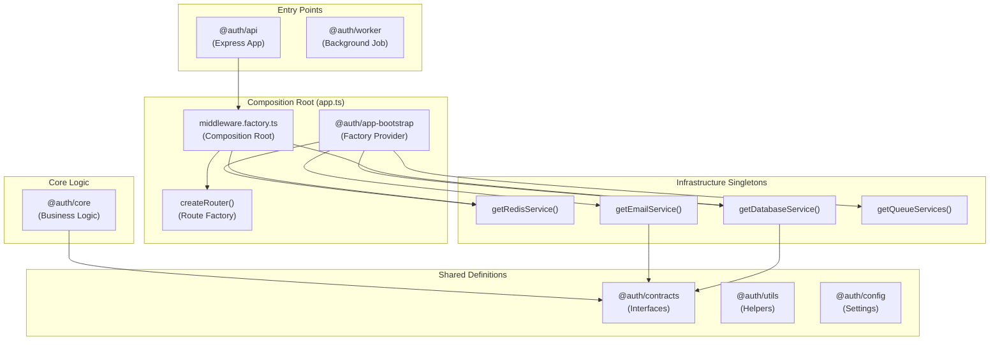

# The "Gold Standard" Monorepo: A Beginner's Guide

Welcome to the backend monorepo! If you feel like everything is new and overwhelming, don't worry. This guide is written specifically for you. We're going to break down this "Gold Standard" production-grade application from top to bottom, explaining **what** everything is and **why** it's there.

## The Big Picture: Why this way?

Most tutorials show you "Toy Code" - putting everything in one file (like `index.js`). That's fine for a hobby, but in the real world (companies like Google, Netflix, Uber), code needs to be **scalable**, **maintainable**, and **testable**.

This project uses a **Monorepo** structure (multiple "packages" in one git repository), **Clean Architecture**, and **Gold Standard Dependency Injection**.

### The "Restaurant" Analogy
Think of the entire backend as a professional restaurant:

1.  **Restaurant Opening Ceremony (@auth/app-bootstrap)**: The manager checks all equipment, turns on lights, tests the stove. All dependencies are wired together here.
2.  **Waiters (@auth/api)**: They take the customer's order (HTTP Request) and bring it to the kitchen. They don't cook, they just communicate.
3.  **Kitchen Manager (@auth/core)**: They decide what needs to be done. "We need a User Registration? Okay, check if they exist, create the user, and send a welcome email."
4.  **Chefs (@auth/worker)**: They handle the heavy, slow work in the back, like chopping 500 onions (sending 10,000 emails or processing videos). They work in the background so the waiters aren't blocked.
5.  **Recipe Book (@auth/contracts)**: The strict rules and agreements. "A 'Burger' MUST have a bun and meat." (Interface definitions).
6.  **Pantry (@auth/database)**: Where the raw ingredients (Data) are stored.
7.  **Utilities (@auth/config, @auth/utils)**: The specialized tools—knives, ovens, lights, and rule compliance (Environment variables, Logging).

---

## Architecture Diagram



---

## The Gold Standard: Dependency Injection

### What Changed: Factory Pattern Everywhere

Instead of importing singletons directly, we use **factory functions** that accept dependencies:

```typescript
// ❌ OLD WAY (Tight Coupling)
import { redisConnection } from "@auth/config";
const cached = await redisConnection.get(key);

// ✅ NEW WAY (Gold Standard DI)
export function createCacheMiddleware(deps: { redis: IRedisConnection }) {
  const { redis } = deps;
  return async (req, res, next) => {
    const cached = await redis.get(key); // Uses injected dependency
  };
}
```

### Composition Root Pattern

All dependencies are wired together in ONE place: `app.ts`

```typescript
// app.ts - The Composition Root
import { getRedisService, getDatabaseService } from "@auth/app-bootstrap";
import { createMiddleware } from "./middleware/middleware.factory.js";
import { createRouter } from "./router.js";

// 1. Get singletons from bootstrap
const redis = getRedisService();
const databaseService = getDatabaseService();

// 2. Create all middleware with dependencies
const middleware = createMiddleware({ redis, databaseService });

// 3. Create router with dependencies
const router = createRouter({
  authLimiter: middleware.authLimiter,
  healthRoutes: middleware.healthRoutes,
});

// 4. Use them
app.use("/api", middleware.apiLimiter);
app.use("/api", router);
```

---

## Package Deep Dive

### 1. The "Soul": @auth/contracts
**Path:** `packages/contracts`
This is the **most important package**. It defines the "Agreements" (TypeScript Interfaces).
*   **Purpose:** It tells you *what* something does, without caring *how*.
*   **Key Interface:** `IRedisConnection` - defines all Redis methods (get, set, setex, del, call, etc.)
*   **Example:** `IEmailService` says "I permit sending an email." It doesn't care if you use Gmail, AWS, or a pigeon.

### 2. The "Brain": @auth/config
**Path:** `packages/config`
The central nervous system for settings.
*   **Lazy Factories:** `getRedisConnection()` creates Redis connection only when first called
*   **Schema Validation:** `env.schema.ts` validates all environment variables with Zod
*   **No Side Effects:** Importing config doesn't create connections - you must call factory functions

### 3. The "Glue": @auth/app-bootstrap
**Path:** `packages/app-bootstrap`
**NEW: This is now the central singleton provider.**
*   **Purpose:** Provides lazy singletons for all infrastructure services
*   **Key Exports:**
    - `getRedisService()` - Redis connection singleton
    - `getDatabaseService()` - MongoDB connection singleton
    - `getEmailService()` - Email service singleton
    - `getQueueServices()` - Queue producer singletons

### 4. The "Memory": @auth/database
**Path:** `packages/database`
*   **Tech:** MongoDB + Mongoose.
*   **Pattern:** Uses the **Repository Pattern**. Instead of writing raw DB queries in your logic, you call `userRepository.create()`.

### 5. The "Logic": @auth/core
**Path:** `packages/core`
Where the business rules live.
*   **Services:** (e.g., `RegistrationService`) The logic. "Check rate limit -> Save User -> Queue Email".
*   **Controllers:** (e.g., `RegistrationController`) The HTTP handler. "Read body -> Call Service -> Return JSON".
*   **Constructor Injection:** All dependencies passed in constructor.

### 6. The "Gateway": @auth/api
**Path:** `packages/api`
The HTTP Server (Express).
*   **Composition Root:** `app.ts` is where all dependencies are wired
*   **Middleware Factory:** `middleware.factory.ts` creates all middleware with injected dependencies
*   **Router Factory:** `createRouter()` accepts middleware dependencies

#### Key Files:
- `app.ts` - Composition root, wires all dependencies
- `middleware/middleware.factory.ts` - Creates all middleware instances
- `router.ts` - Factory that creates API routes

### 7. The "Messenger": @auth/email
**Path:** `packages/email`
*   **Resilience:** Uses a **Circuit Breaker**. If the email provider crashes, it temporarily stops trying to send emails.
*   **Failover:** Tries **Resend** first. If that fails, it automatically switches to **MailerSend**.

### 8. The "Muscle": @auth/worker
**Path:** `packages/worker`
The background process.
*   **Why?** Sending an email takes 1-2 seconds. We don't want the user to wait.
*   **How?** The API puts a "Job" in a queue (Redis). The Worker picks it up and processes it in the background.

---

## Key Concepts & Terms

### Factory Functions (Gold Standard DI)
Every middleware, controller, and service is created via factory functions:

```typescript
// Factory accepts dependencies
export function createApiLimiter(deps: { redis: IRedisConnection }): RequestHandler {
  const { redis } = deps;
  return rateLimit({
    store: createRedisStore(redis, "rl:api:"),
    // ...
  });
}

// Used in composition root
const apiLimiter = createApiLimiter({ redis });
app.use("/api", apiLimiter);
```

### Why Factories? (Benefits)
1. **Testability:** Pass mock Redis in tests, no `vi.mock()` needed
2. **Explicit Dependencies:** Just read the function signature to see what it needs
3. **No Hidden State:** No globals or singletons imported randomly
4. **Swap Implementations:** Easy to change Redis to another cache

### Observability (OpenTelemetry)
We don't just "log" text. We create **Traces**.
A Trace is like a timeline bar chart showing exactly where time was spent.

### Zod Validation
We never trust user input. **Zod** is a library that forces data to match a shape.
`z.string().email()` ensures the variable is *actually* an email before our code touches it.

---

## How a Request Flows (Example: Registration)

1.  **User** sends `POST /register`.
2.  **@auth/api/app.ts** receives it (dependencies already wired in composition root).
3.  **Router** (created via `createRouter()`) passes to `RegistrationController`.
4.  **Controller** calls `RegistrationService` (injected via constructor).
5.  **Service** starts a **Transaction** (all or nothing).
    *   Creates User in **Database**.
    *   Queues "Send Welcome Email" job in **Redis**.
6.  **Service** returns "Success". User sees "Check your email!" immediately.
7.  (...Milliseconds later...)
8.  **@auth/worker** wakes up, sees the job.
9.  **Worker** calls **@auth/email**.
10. **@auth/email** sends the actual email via Resend.

---

## Summary

You are looking at a codebase designed to scale to millions of users. It:
- **Separates concerns** (Logic vs. Database vs. HTTP)
- **Uses Gold Standard DI** (Factory functions, composition root)
- **Handles failures gracefully** (Circuit Breakers)
- **Tells you exactly what it's doing** (Traces)

The key insight: **All dependencies flow from the composition root (`app.ts`) downward. No file imports singletons directly - everything is injected.**

Mastering this structure means you can work on any complex enterprise system in the world.
