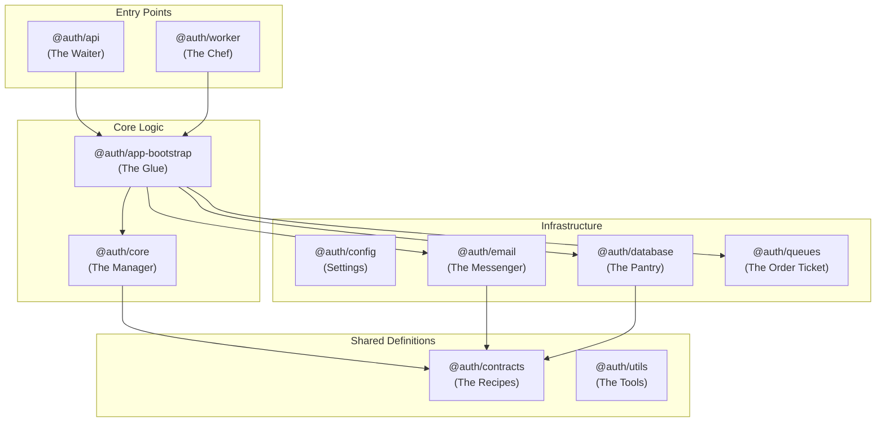

# The "Gold Standard" Monorepo: A Beginner's Guide

Welcome to the backend monorepo! If you feel like everything is new and overwhelming, don't worry. This guide is written specifically for you. We're going to break down this "Gold Standard" production-grade application from top to bottom, explaining **what** everything is and **why** it's there.

## The Big Picture: Why this way?

Most tutorials show you "Toy Code" - putting everything in one file (like `index.js`). That's fine for a hobby, but in the real world (companies like Google, Netflix, Uber), code needs to be **scalable**, **maintainable**, and **testable**.

This project uses a **Monorepo** structure (multiple "packages" in one git repository) and **Clean Architecture**.

### The "Restaurant" Analogy
Think of the entire backend as a professional restaurant:

1.  **Waiters (@auth/api)**: They take the customer's order (HTTP Request) and bring it to the kitchen. They don't cook, they just communicate.
2.  **Kitchen Manager (@auth/core)**: They decide what needs to be done. "We need a User Registration? Okay, check if they exist, create the user, and send a welcome email."
3.  **Chefs (@auth/worker)**: They handle the heavy, slow work in the back, like chopping 500 onions (sending 10,000 emails or processing videos). They work in the background so the waiters aren't blocked.
4.  **Recipe Book (@auth/contracts)**: The strict rules and agreements. "A 'Burger' MUST have a bun and meat." (Interface definitions).
5.  **Pantry (@auth/database)**: Where the raw ingredients (Data) are stored.
6.  **Utilities (@auth/config, @auth/utils)**: The specialized tools—knives, ovens, lights, and rule compliance (Environment variables, Logging).

---

## Architecture Diagram



---

## Package Deep Dive

### 1. The "Soul": @auth/contracts
**Path:** `packages/contracts`
This is the **most important package**. It defines the "Agreements" (TypeScript Interfaces).
*   **Purpose:** It tells you *what* something does, without caring *how*.
*   **Example:** `IEmailService` says "I permit sending an email." It doesn't care if you use Gmail, AWS, or a pigeon. This makes the code easy to change later.

### 2. The "Brain": @auth/config
**Path:** `packages/config`
The central nervous system for settings.
*   **Strictness:** It validates every single environment variable (like `DATABASE_URL`) on startup. If one is missing, the app crashes immediately with a helpful error, preventing hidden bugs.
*   **Observability:** It sets up **Tracing** (OpenTelemetry) and **Logging** (Pino) so we can see everything happening in production.

### 3. The "Memory": @auth/database
**Path:** `packages/database`
*   **Tech:** MongoDB + Mongoose.
*   **Pattern:** Uses the **Repository Pattern**. Instead of writing raw DB queries in your logic, you call `userRepository.create()`. This makes testing easy because we can mock the repository.

### 4. The "Logic": @auth/core
**Path:** `packages/core`
Where the business rules live.
*   **Services:** (e.g., `RegistrationService`) The logic. "Check rate limit -> Save User -> Queue Email".
*   **Controllers:** (e.g., `RegistrationController`) The HTTP handler. "Read body -> Call Service -> Return JSON".
*   **Manual Dependency Injection:** We manually pass the Database and Email service into the Registration Service. No "Magic" frameworks. You can verify exactly what a service uses by looking at its `constructor`.

### 5. The "Messenger": @auth/email
**Path:** `packages/email`
*   **Resilience:** Uses a **Circuit Breaker**. If the email provider crashes, it temporarily stops trying to send emails to prevent the whole system from jamming.
*   **Failover:** Tries **Resend** first. If that fails, it automatically switches to **MailerSend**.

### 6. The "Muscle": @auth/worker
**Path:** `packages/worker`
The background process.
*   **Why?** Sending an email takes 1-2 seconds. We don't want the user to wait at a loading spinner.
*   **How?** The API puts a "Job" in a queue (Redis). The Worker picks it up instantly and does it in the background.

### 7. The "Gateway": @auth/api
**Path:** `packages/api`
The HTTP Server (Express).
*   **Role:** It's just the entry point. It receives requests, checks security (Auth headers), and forwards them to `@auth/core`.

---

## Key Concepts & Terms

### Manual Dependency Injection (DI)
Instead of importing everything globally (which makes testing hard), we pass dependencies into functions/classes.
**Bad:**
```javascript
import db from './db'; // Hard dependency
const createUser = () => db.save();
```
**Good (Our Way):**
```javascript
class UserService {
  constructor(database) { this.database = database; } // Injected!
  createUser() { this.database.save(); }
}
```

### Observability (OpenTelemetry)
We don't just "log" text. We create **Traces**.
A Trace is like a timeline bar chart. It shows:
1.  Request hitting the API (0ms)
2.  Checking Redis Cache (2ms)
3.  Saving to MongoDB (50ms)
4.  Sending response (55ms)
This helps us spot slow code instantly.

### Zod Validation
We never trust user input. **Zod** is a library that forces data to match a shape.
`z.string().email()` ensures the variable is *actually* an email before our code touches it.

---

## How a Request Flows (Example: Registration)

1.  **User** sends `POST /register`.
2.  **@auth/api** receives it.
3.  **Router** passes it to strictly typed `RegistrationController`.
4.  **Controller** calls `RegistrationService`.
5.  **Service** starts a **Transaction** (all or nothing).
    *   Creates User in **Database**.
    *   Queues "Send Welcome Email" job in **Redis**.
6.  **Service** returns "Success". User sees "Check your email!" immediately.
7.  (...Milliseconds later...)
8.  **@auth/worker** wakes up, sees the job.
9.  **Worker** calls **@auth/email**.
10. **@auth/email** sends the actual email via Resend.

---

## Summary
You are looking at a codebase designed to scale to millions of users. It separates concerns (Logic vs. Database vs. HTTP), handles failures gracefully (Circuit Breakers), and tells you exactly what it's doing (Traces).

Mastering this structure means you can work on any complex enterprise system in the world.
