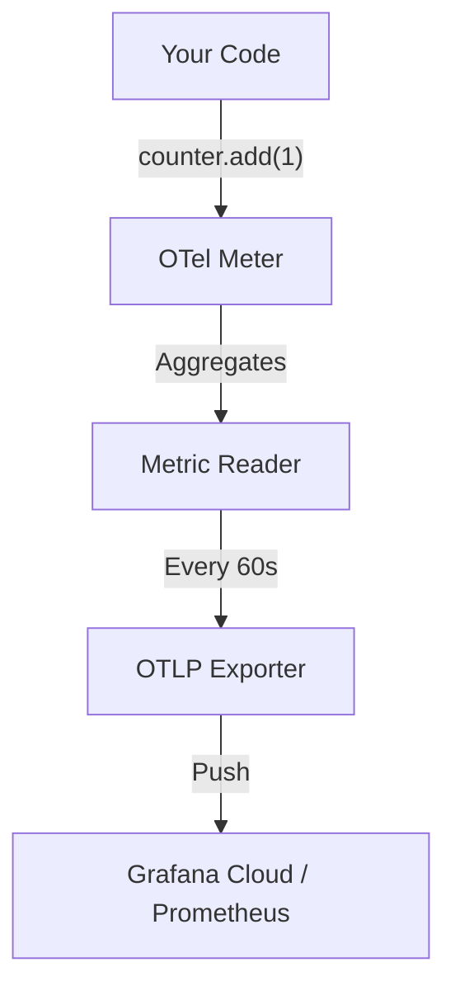

# 📊 Metrics Manual

This document explains the Metrics system (**OpenTelemetry + Prometheus**) and how to track numbers (like "Total Emails Sent").

---

## 🔄 The Lifecycle (Visualized)



---

## ⚡ Quick Start (How to use it)

### 1. Counting Things (Counter)
Use this for numbers that only go up (e.g., "Total Users Registered").

```typescript
import { emailSendTotal } from "@auth/observability";

// Increment by 1
emailSendTotal.add(1, { 
  type: "welcome_email", 
  status: "success" 
});
```

### 2. Measuring Time/Size (Histogram)
Use this for distributions (e.g., "How long did it take?").

```typescript
import { emailSendDuration } from "@auth/observability";

const startTime = Date.now();
// ... do work ...
const durationInSeconds = (Date.now() - startTime) / 1000;

emailSendDuration.record(durationInSeconds, { 
  provider: "resend" 
});
```

---

## 🏗️ Architecture Design

**Does it use the Factory Pattern?**
**NO.** Unlike the Logger, Metrics uses the **Singleton Pattern**.

*   **Global Registry**: OpenTelemetry maintains a global "MeterProvider".
*   **Module Scope**: We define metrics (like `emailSendTotal`) as exported constants in `packages/observability/src/metrics.ts`.
*   **Why?**: You want "Total Emails" to be the same counter everywhere in the app. You don't want 5 different counters with the same name.

---

## ⚙️ Configuration (Tweaking the System)

### 1. Enable/Disable
```ini
METRICS_ENABLED=true
```

### 2. Export Destination
```ini
# Defaults to Grafana Cloud if keys are present
GRAFANA_PROMETHEUS_URL=...
GRAFANA_PROMETHEUS_USER=...
GRAFANA_PROMETHEUS_API_KEY=...
```

---

## 🛠️ Advanced Customization

### Where to add new metrics?
**File:** [`packages/observability/src/metrics.ts`](file:///packages/observability/src/metrics.ts)

To add a new metric, define it here and export it.

```typescript
// 1. Get the shared meter
const meter = metrics.getMeter("auth-observability-metrics");

// 2. Define your new metric
export const myNewCounter = meter.createCounter("my_feature_usage", {
    description: "Tracks how many times feature X is used"
});
```

Then import it in your service:
```typescript
import { myNewCounter } from "@auth/observability";
myNewCounter.add(1);
```
