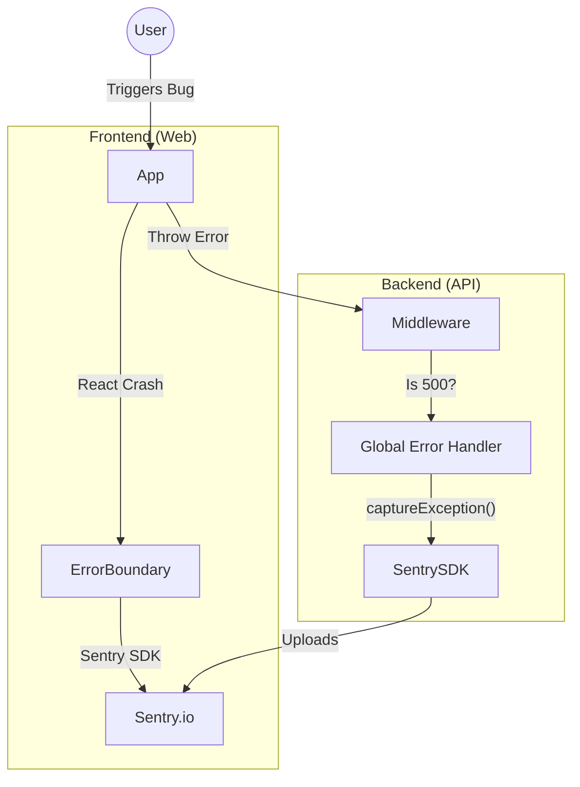

# 🐞 Sentry Manual (Error Tracking)

This document explains the Error Tracking system (**Sentry**) and how we catch bugs before users report them.

---

## ⚡ Quick Start (How to use it)

### 1. Automatic Capture
You generally **don't** need to do anything! 
*   **Backend:** Any 500 Error (System Crash) is automatically sent to Sentry by the global Error Handler.
*   **Frontend:** Any React Crash (White Screen) is automatically sent by the Error Boundary.

### 2. Manual Capture (Backend)
If you catch an error but want to report it without crashing the app:

```typescript
import { captureException } from "@auth/observability";

try {
  await precariousOperation();
} catch (error) {
  // Report to Sentry but keep running
  captureException(error, {
    tags: { module: "payment" },
    user: { id: "user_123" }
  });
}
```

---

## 🔄 The Lifecycle (Visualized)

How an error travels from your code to the Sentry Dashboard:



---

## ⚙️ Configuration

### 1. Enable/Disable
Sentry is enabled if `SENTRY_DSN` is set AND (Environment is Production OR `SENTRY_DEV_ENABLED=true`).

```ini
SENTRY_DSN=https://examplePublicKey@o0.ingest.sentry.io/0
SENTRY_DEV_ENABLED=true # Optional: Enable in local dev
```

---

## 🏗️ Architecture & Code Flows

### Backend Integration
We use a **Centralized Observability** pattern.

1.  **Initialization**:
    *   **File:** [`packages/observability/src/sentry.ts`](file:///packages/observability/src/sentry.ts)
    *   Called by `server.ts` at startup. It installs the Sentry Node SDK and Profiling integration.

2.  **Access Point**:
    *   We do **NOT** import `@sentry/node` directly in feature code.
    *   We import `captureException` from `@auth/observability`.
    *   *Why?* This prevents vendor lock-in and allows us to swap Sentry for another tool later easily.

3.  **The Filter (Smart Error Handling)**:
    *   **File:** [`packages/api/src/middleware/core/errorHandler.ts`](file:///packages/api/src/middleware/core/errorHandler.ts)
    *   **Logic:**
        *   IF `statusCode >= 500` (Server Error) -> **Send to Sentry**.
        *   IF `statusCode < 500` (Bad Request, Validation) -> **Ignore** (Don't spam Sentry).

---

## ❓ FAQ

**Q: Why don't I see errors in Sentry locally?**
A: By default, we disabled Sentry in development to save your quota. Set `SENTRY_DEV_ENABLED=true` in `.env` if you want to test it.

**Q: Does it capture user data?**
A: Yes. The Error Handler automatically attaches the `userId`, `method`, and `requestUrl` to the error report to help you debug.
