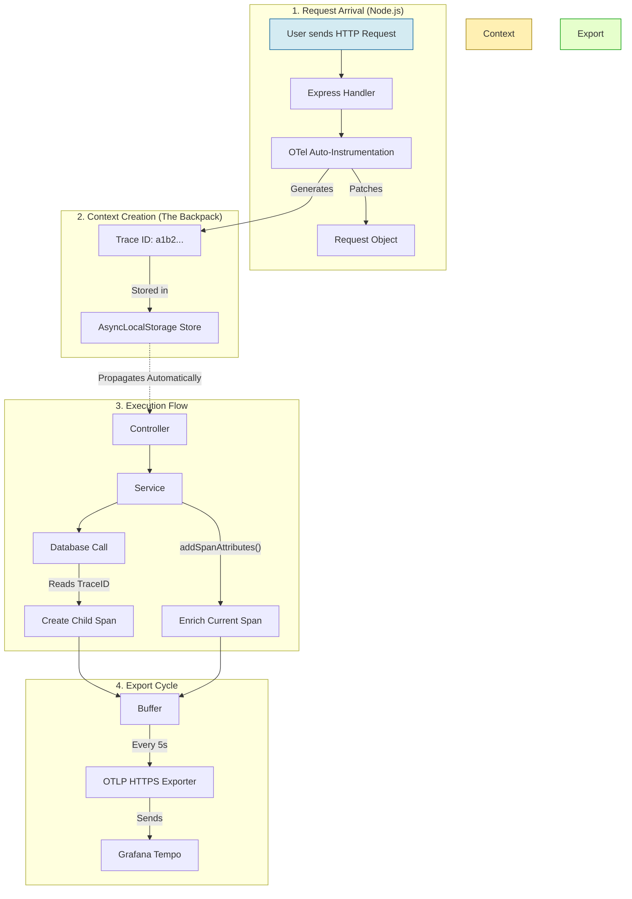

# 🕵️‍♂️ Distributed Tracing Manual

This document explains the Tracing system (built on **OpenTelemetry**) and how to use it to debug performance issues and errors.

---

## ⚡ Quick Start (How to use it)

You generally don't need to do anything! **Auto-instrumentation** handles 90% of the work.
*   Incoming HTTP Requests (`POST /register`) -> **Auto-Traced**
*   Database Queries (`mongoose.find`) -> **Auto-Traced**
*   Redis Commands (`redis.get`) -> **Auto-Traced**

### 1. Adding Custom Details (`addSpanAttributes`)
If you want to add extra info to the *current* trace (like "Validation Failed" or "User ID"), use this helper.

```typescript
import { addSpanAttributes } from "@auth/observability";

// ... inside your function ...
addSpanAttributes({
  "user.id": user.id,
  "payment.amount": 500,
  "validation.error": "Invalid email format"
});
```

### 2. Creating Custom Spans (`withSpan`)
If you have a block of code that takes a long time (e.g., complex calculation) and isn't auto-traced, wrap it in a span.

```typescript
import { withSpan } from "@auth/observability";

await withSpan("calculate.prime_numbers", async () => {
  // Your heavy logic here...
  await heavyMathFunction();
});
```
*Result:* You will see a bar named `calculate.prime_numbers` in your Grafana flame graph.

---

## ⚙️ Configuration (Tweaking the System)

### 1. Enable/Disable Tracing
In your `.env` file:
```ini
TRACING_ENABLED=true  # Set to 'false' to turn off completely
```

### 2. Connect to Grafana
To see the traces, you need to point the exporter to Grafana Cloud (or a local Tempo instance).
```ini
GRAFANA_TEMPO_URL=https://tempo-us-central1.grafana.net/tempo
GRAFANA_TEMPO_USER=123456
GRAFANA_TEMPO_API_KEY=glc_...
```

---

## 🛠️ Advanced Customization

### Where are the rules defined?
**File:** [`packages/observability/src/tracing.ts`](file:///packages/observability/src/tracing.ts)

This is the "Brain" of the tracing system. Modify this file if you need to:

#### A. Add New Auto-Instrumentation
If you add a new database (e.g., Postgres or MySQL), you must enable it here.

```typescript
// tracing.ts
instrumentations: [
    getNodeAutoInstrumentations({
        // Enable MySQL tracing
        "@opentelemetry/instrumentation-mysql": { enabled: true }, 
    })
]
```

#### B. Filter Out Noisy Traces
We currently ignore `/healthz` and `/metrics` endpoints to save money/space.

```typescript
// tracing.ts
ignoreIncomingRequestHook: (req) => {
    return req.url.includes("/healthz"); // Returns true to skip tracing
}
```

#### C. Change Span Names
If you don't like how traces are named (e.g., `HTTP GET`), check the `spanNameHook` configuration in the same file.

---

## 🧠 How it Works (Under the Hood)

### 1. The Critical Startup Sequence
Tracing MUST be the very first thing to run. If `express` or `http` loads before tracing, they remain "unpatched" and you see no traces.

**Correct Order (`server.ts`):**
```typescript
// 1. Trace Patching (Monkey Patches Node.js internals)
import { initializeTracing } from "@auth/observability";
initializeTracing(); 

// 2. Application Load
import app from "./app.js"; // Explicitly AFTER tracing
```

### 2. The "Invisible Backpack" (AsyncLocalStorage)
How does `addSpanAttributes` know which request it belongs to without you passing `req` objects everywhere?

Node.js has a feature called **AsyncLocalStorage** (ALS). Think of it as a "backpack" that automatically travels with your code execution across functions, promises, and callbacks.
1. Request arrives -> OTel puts `traceId=123` in the backpack.
2. You call DB -> OTel checks backpack, sees `traceId=123`, tags DB call with it.
3. You call `addSpanAttributes` -> It writes to the active span in the backpack.

---

## 🔄 The Trace Lifecycle (Visualized)

Here is the exact journey of a single request:



### Explanation of Diagram:
1.  **Monkey Patching**: OTel wraps the `http.createServer` function. When a request hits, it intercepts it *before* Express.
2.  **Context**: It creates a unique ID and puts it in the ALS "backpack".
3.  **Propagation**: As your code awaits promises (`await service.doWork()`), Node.js ensures the backpack moves to the next microtask.
4.  **Enrichment**: `addSpanAttributes` reaches into the backpack to modify the current span.
5.  **Export**: Spans aren't sent immediately (too slow). They are buffered and sent in batches via HTTPS.
